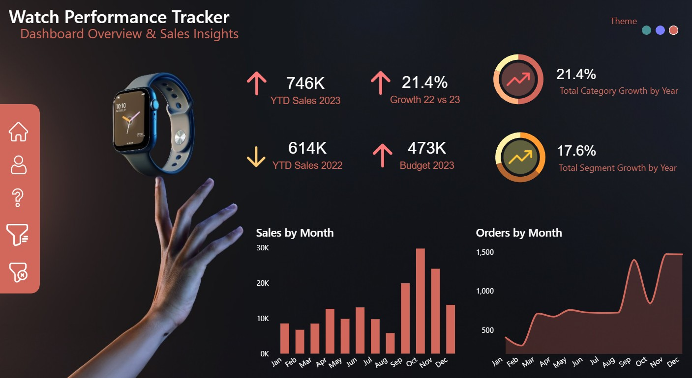
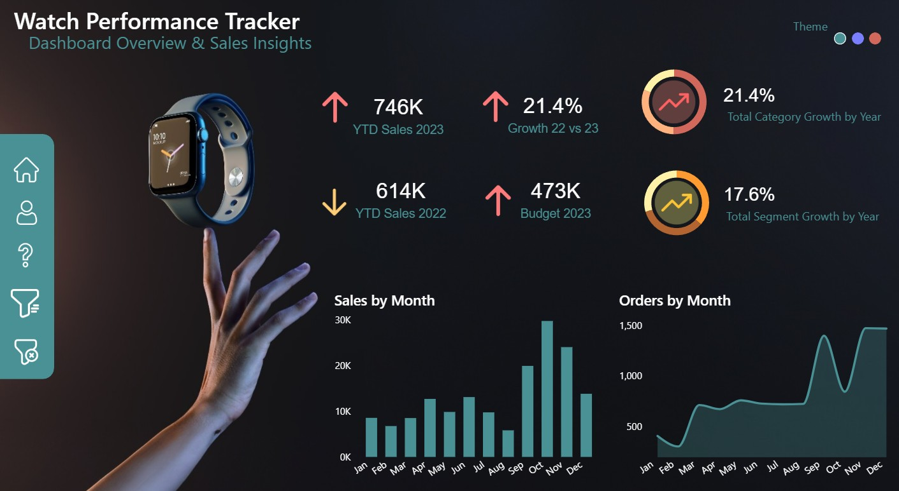
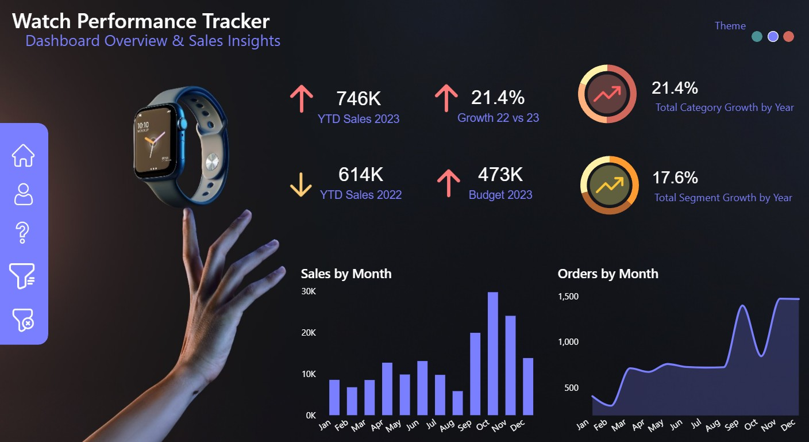

# Watch Performance Tracker: Retail Operations & Sales Insights

## 🎨 Interactive Dynamic UI Themes
This dashboard features an advanced, interactive multi-theme engine allowing corporate stakeholders to toggle the entire visual canvas skin instantly based on reporting preferences.

<p align="center">
  
  
  
</p>

## 📌 Business Case & Project Overview
The **Watch Performance Tracker** is a strategic retail intelligence application designed to analyze sales performance, assess year-over-year growth velocity, and monitor strict budget compliance pipelines. Processing performance cross-sections, this dashboard evaluates **746K in Year-to-Date (YTD) Sales**, capturing a **21.4% annual growth margin** while optimizing strategic inventory tracking against targeted operating budgets.

### 🔗 Public Interactive Link
* [👉 Click Here to Live Test the Dynamic Theme Switching Dashboard](YOUR_POWER_BI_SERVICE_OR_NOVYPRO_LINK_HERE) *

---

## 📊 Dashboard Architecture & Analytical Insights

### 1. High-Impact Strategic Performance Matrix
* **YTD Target Ingestion:** Centralizes core business metrics, displaying **746K YTD Sales (2023)** against a baseline comparison of **614K YTD Sales (2022)**.
* **Budget Tracking:** Gauges fiscal health against a target **473K Budget (2023)** to quickly isolate operational capital availability.
* **Growth Vectors:** Monitors category-specific expansion speeds, segmenting macro organizational movement into **Total Category Growth (21.4%)** and granular **Total Segment Growth (17.6%)**.

### 2. Time-Series Volatility Analytics
* **Sales by Month:** A structured distribution chart highlighting sales velocity shifts across the calendar year. It isolates an operational surge during the Q4 window, maximizing out in **October (>30K sales units)**.
* **Orders by Month:** A continuous line chart tracing platform transaction volume. It visualizes customer conversion patterns and isolates scaling demand peaks shifting from a 500-order baseline to **1,500 monthly transactions** by year-end.

---

## 🛠️ Technical Model Specifications & DAX Logic
* **Theme Switching Engine:** Implemented via decoupled decoupled page states and selection panes bound securely to conditional color variables.
* **Data Schema:** Formulated on a clean Star Schema, connecting transactional sale facts directly to a standardized `Dim_Calendar` matrix to ensure robust Time Intelligence calculation processing.

### Enterprise DAX Measures Showcase

#### Year-To-Date (YTD) Sales Aggregation
```dax
YTD Sales Current Year = 
TOTALYTD(
    SUM('Fact_Sales'[SalesAmount]),
    'Dim_Calendar'[Date_Value]
)  
